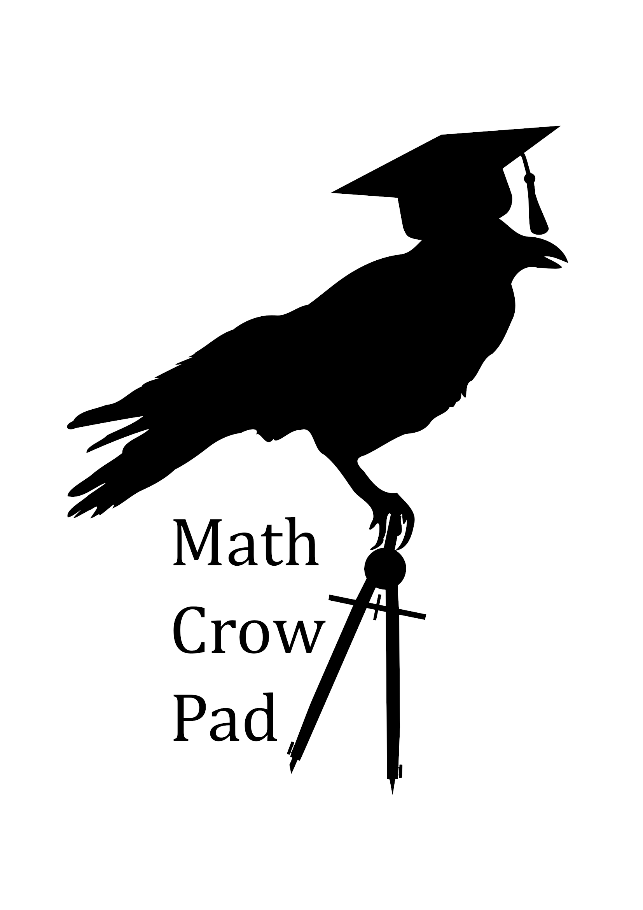

# MathCrowPad

## The MathCrowPad is a numberpad for chemistry, math, and spreadsheets.

Its main three features are:
 * Two knobs to scroll through spreadsheets
 * An oled screen to show guides for the knobs
 * An extra row for parenthisis(), exponent^, factorial!, latex syntax$$ etc.

Feel free to make up to 10 for personal use.
